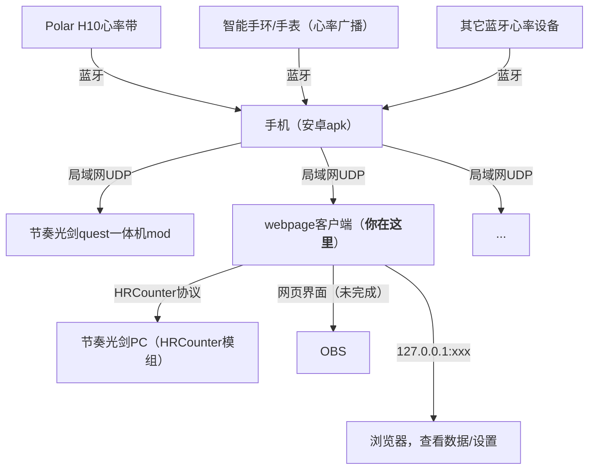

# 蓝牙心率局域网客户端

从局域网的中获取心率信息，然后做些事情。

# 节奏光剑（PCVR）配置说明

> 欢迎使用由Frto027制作的纯局域网心率显示方案！软件实时转发心率数据，不引入额外延迟。

1. 打开蓝牙心率设备，与安卓手机配对。
2. 安卓手机安装[APK](https://github.com/frto027/HeartbeatLanServer/releases/latest)并打开([一键下载](https://github.com/frto027/HeartbeatLanServer/releases/download/v1.1/heartbeatlan-1.1.apk))，勾选想要使用的蓝牙设备，和PC连入同一个局域网内。请确保局域网内支持UDP广播。
3. [下载](https://github.com/frto027/HeartbeatLanClient)（[一键下载](https://github.com/frto027/HeartbeatLanClient/releases/download/v1.0/heartbeat-lan-client-1.0.zip)）并打开这个软件，进入[这里](http://127.0.0.1:8842)观察软件设置。该页面提供配置好的[HRCounter模组](https://github.com/qe201020335/HRCounter)，请下载后手动覆盖至节奏光剑的安装文件夹中。
4. 打开游戏即可游玩。

别忘了设置手机APP的省电策略为无限制（或类似选项）。不必担心后台驻留，点击“关闭程序”按钮后，程序会进行完全的自我抹除。

# 节奏光剑（一体机Quest）配置说明

apk是同一个，但[用这个mod](https://github.com/frto027/HeartBeatLanClientBSQuest)就可以直接在游戏中显示心率数据了!

# Quest一体机

[用这个](https://github.com/frto027/HeartBeatLanClientBSQuest)!

# 它的原理

- [Android phone](https://github.com/frto027/HeartbeatLanServer/releases/latest) apk download here
- [HRCounter](https://github.com/qe201020335/HRCounter) A fast config generator is included in this software.

The broadcast only used for server-pair. It is all private UDP connection if you turn off it after paried.

TODO List:

- ~~make port number configurable~~ make a [issue](https://github.com/frto027/HeartbeatLanClient/issues) if anybody need this feature
- a beautiful heart ui for OBS
- maybe support other games

# License

MIT License