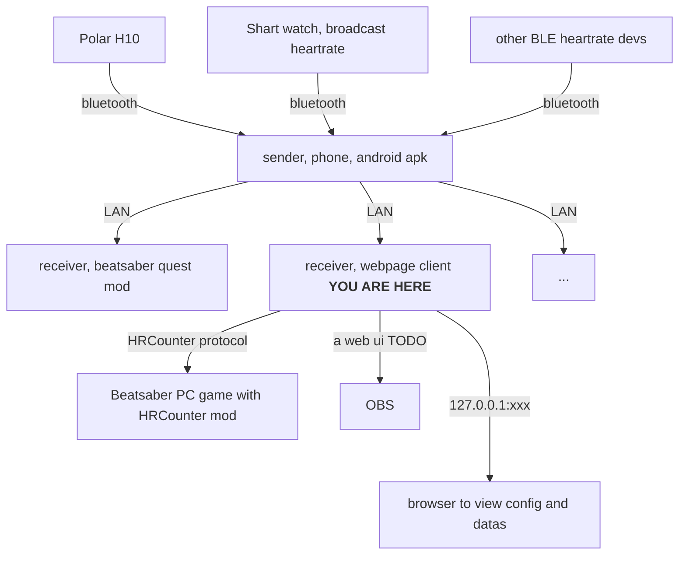

# HeartbeatLanReceiver

[中文](README.cn.md)

Receive heartrate via UDP LAN, and do more things.

# Fast setup for BeatSaber(PCVR)

TLDR all steps are...

1. Open the heartrate BLE device
2. Open Android APP
3. Open the Desktop APP
4. Open the game

Do the following thing for the first setup.

1. Pair your BLE Heartrate devices with your Andorid phone.
2. Ensure the android device and your computer connect to same network.
3. Install and open the Android app, select the heart devices you want broadcast.
4. In your computer, install and open this app.
5. (Optional)Open [the web browser](http://127.0.0.1:8842) to see all datas form BLE devices.
6. Install HRCounter mod for your beatsaber game, and use the config file. A pre configured mod is included in the software.
7. play the game.

The config file:
```json
{"DataSource":"WebRequest","FeedLink":"http://127.0.0.1:8842/heart"}
```

everything works fine. It will work fine. I trust it!

# Fast setup for BeatSaber(Quest)

[Please use this mod](https://github.com/frto027/HeartBeatLanClientBSQuest)!

# What it does


- [Android phone](https://github.com/frto027/HeartbeatLanServer/releases/latest) apk download here
- [HRCounter](https://github.com/qe201020335/HRCounter) A fast config generator is included in this software.

The broadcast only used for server-pair. It is all private UDP connection if you turn off it after paried.

TODO List:

- ~~make port number configurable~~ make a [issue](https://github.com/frto027/HeartbeatLanClient/issues) if anybody need this feature
- a beautiful heart ui for OBS
- maybe support other games

# License

MIT License
